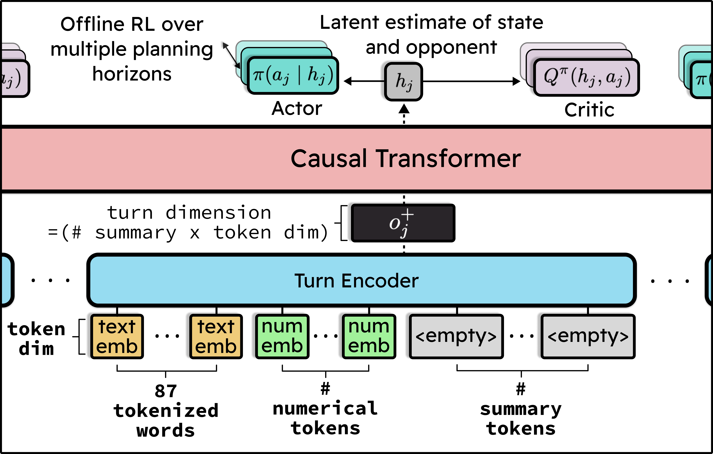
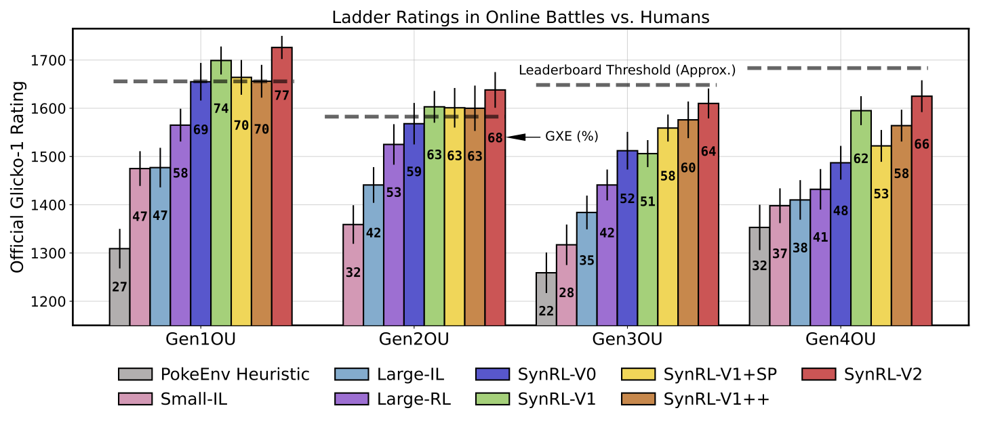
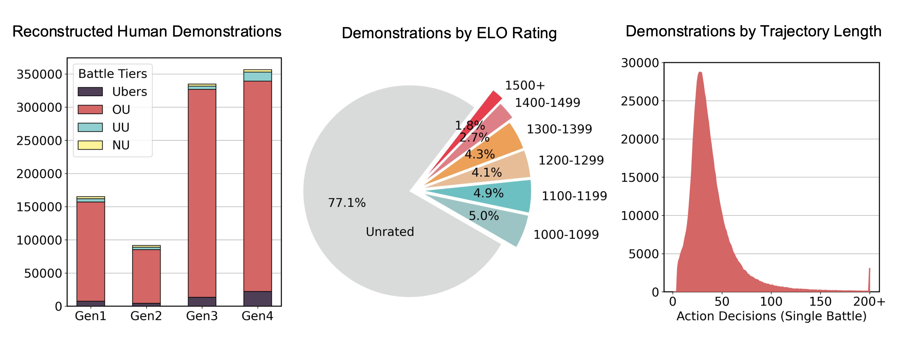
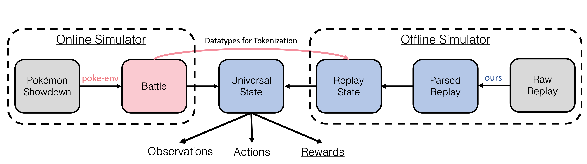

<div align="center">
    
</div>

<br>

<div align="center">
    
</div>

<br>

<div align="center">

[](https://arxiv.org/abs/2504.04395)
[](https://metamon.tech)

</div>


<br>


**Metamon** enables reinforcement learning (RL) research on [Pokémon Showdown](https://pokemonshowdown.com/) (PS) by providing:

1) A standardized suite of teams and opponents for evaluation.
2) A large dataset of RL trajectories "reconstructed" from real human battles.
3) Starting points for training imitation learning (IL) and RL policies.

Metamon is the codebase behind ["Human-Level Competitive Pokémon via Scalable Offline RL and Transformers"](https://arxiv.org/abs/2504.04395) (RLC, 2025). Please check out our [project website](https://metamon.tech) for an overview of our results. This README documents the dataset, pretrained models, training, and evaluation details to help you get battling!

<br>

<div align="center">
    
</div>

<br>

#### Supported Rulesets

Pokémon Showdown hosts many different rulesets spanning nine generations of the video game franchise. Metamon initially focused on the most popular singles ruleset ("OverUsed") for **Generations 1, 2, 3, and 4**. However, we are gradually expanding to Gen 9 to support the [NeurIPS 2025 PokéAgent Challenge](https://pokeagent.github.io). This is a large project that will not be finalized in time for the competition launch; please stay tuned for updates.

The current status is:

|  | Gen 1 OU | Gen 2 OU | Gen 3 OU | Gen 4 OU | Gen 9 OU |
|------------|---------------------|----------|----------|----------|----------|
| Datasets | ✅ | ✅ | ✅ | ✅ | 🟠 (beta) |
| Teams | ✅ | ✅ | ✅ | ✅ | ✅  |
| Heuristic Baselines | ✅ | ✅ | ✅ | ✅ | ✅ |
| Learned Baselines | ✅ | ✅ | ✅ | ✅ | 🚧 TODO |

We also support the UnderUsed (UU), NeverUsed (NU), and Ubers tiers for Generations 1, 2, 3, and 4 —-- though constant rule changes and small dataset sizes have always made these a bit of an afterthought.


<br>


### Table of Contents
1. [**Installation**](#installation)

2. [**Quick Start**](#quick-start)

3. [**Pretrained Models**](#pretrained-models)

4. [**Battle Datasets**](#battle-datasets)

5. [**Team Sets**](#team-sets)

6. [**Baselines**](#baselines)

7. [**Observation Spaces, Action Spaces, & Reward Functions**](#observation-spaces-action-spaces--reward-functions)

8. [**Training and Evaluation**](#training-and-evaluation)

9. [**Other Datasets**](#other-datasets)

10. [**Battle Backends**](#battle-backends)

11. [**Acknowledgement**](#acknowledgement)

12. [**Citation**](#citation)


<br>
 
---

<br>

## Installation

Metamon is written and tested for linux and python 3.10+. We recommend creating a fresh virtual environment or [conda](https://docs.anaconda.com/anaconda/install/) environment:

```shell
conda create -n metamon python==3.10
conda activate metamon
```

Then, install with:

```shell
git clone --recursive git@github.com:UT-Austin-RPL/metamon.git
cd metamon
pip install -e .
```

To install [Pokémon Showdown](https://pokemonshowdown.com/), we'll need a modern version of `npm` / Node.js (instructions [here](https://nodejs.org/en/download/package-manager)). Note that Showdown undergoes constant updates... breaking changes are rare, but do happen. The version that downloads with this repo (`metamon/server`) is always supported.

```shell
cd server/pokemon-showdown
npm install
```

We will need to have the PS server running in the background while using Metamon:
```shell
# in the background (`screen`, etc.)
node pokemon-showdown start --no-security
# no-security removes battle speed throttling and password requirements on your local server
```

If necessary, we can customize the server settings (`config/config.js`) or [the rules for each game mode](https://github.com/smogon/pokemon-showdown/blob/master/config/CUSTOM-RULES.md).

Verify that installation has gone smoothly with:
```bash
# run a few test battles on the local server
python -m metamon.env
```

Metamon provides large datasets of Pokémon team files, human battles, and other statistics that will automatically download when requested. Specify a path with:
```bash
# add to ~/.bashrc
export METAMON_CACHE_DIR=/path/to/plenty/of/disk/space
```

<br>

____

<br>

## Quick Start

Metamon makes it easy to turn Pokémon into an RL research problem. Pick a set of Pokémon teams to play with, an observation space, an action space, and a reward function:

```python
from metamon.env import get_metamon_teams
from metamon.interface import DefaultObservationSpace, DefaultShapedReward, DefaultActionSpace

team_set = get_metamon_teams("gen1ou", "competitive")
obs_space = DefaultObservationSpace()
reward_fn = DefaultShapedReward()
action_space = DefaultActionSpace()
```

Then, battle against built-in baselines (anything in `metamon.baselines` or any [`poke_env.Player`](https://github.com/hsahovic/poke-env)):

```python 
from metamon.env import BattleAgainstBaseline
from metamon.baselines.heuristic.basic import Gen1BossAI

env = BattleAgainstBaseline(
    battle_format="gen1ou",
    observation_space=obs_space,
    action_space=action_space,
    reward_function=reward_fn,
    team_set=team_set,
    opponent_type=Gen1BossAI,
)

# standard `gymnasium` environment
obs, info = env.reset()
next_obs, reward, terminated, truncated, info = env.step(env.action_space.sample())
```

The more flexible option is to request battles on our local Showdown server and battle anyone else who is online (humans, pretrained agents, or other Pokémon AI projects). If it plays Showdown, we can battle against it!

```python
from metamon.env import QueueOnLocalLadder

env = QueueOnLocalLadder(
    battle_format="gen1ou",
    username="my_scary_username",
    num_battles=10,
    observation_space=obs_space,
    action_space=action_space,
    reward_function=reward_fn,
    team_set=team_set,
)
```

Metamon's main feature is that it creates a dataset of "reconstructed" human demonstrations for these environments:

```python
from metamon.data import ParsedReplayDataset
# pytorch dataset. examples are converted to 
# the chosen obs/actions/rewards on-the-fly.
offline_dset = ParsedReplayDataset(
    observation_space=obs_space,
    action_space=action_space,
    reward_function=reward_func,
    formats=["gen1ou"],
)
obs_seq, action_seq, reward_seq, done_seq = offline_dset[0]
```

We can save our own agents' experience in the same format:

```python
env = QueueOnLocalLadder(
    .., # rest of args
    save_trajectories_to="my_data_path",
)
online_dset = ParsedReplayDataset(
    dset_root="my_data_path",
    observation_space=obs_space,
    action_space=action_space,
    reward_function=reward_func,
)
terminated = False
while not terminated:
    *_, terminated, _, _ = env.step(env.action_space.sample())
# find completed battles before loading examples
online_dset.refresh_files()
```

You are free to use this data to train an agent however you'd like, but we provide starting points for smaller-scale IL (`python -m metamon.il.train`) and RL (`python -m metamon.rl.train`), and a large set of pretrained models from our paper.


<br>

____

<br>


## Pretrained Models

We have made every checkpoint of 18 models available on huggingface at [`jakegrigsby/metamon`](https://huggingface.co/jakegrigsby/metamon/tree/main). Pretrained models can run without research GPUs, but you will need to install [`amago`](https://github.com/UT-Austin-RPL/amago), which is an RL codebase by the same authors. Follow instructions [here](https://ut-austin-rpl.github.io/amago/installation.html).


<div align="center">
    
</div>

<br>

Load and run pretrained models with `metamon.rl.eval_pretrained`. For example:

```bash
python -m metamon.rl.eval_pretrained --agent SyntheticRLV2 --gens 1 --formats ou --n_challenges 50 --eval_type heuristic
```

Will run the default checkpoint of the best model for 50 battles against a set of heuristic baselines highlighted in the paper.

Or to battle against whatever is logged onto the local Showdown server (including other pretrained models that are already waiting):

```bash
python -m metamon.rl.eval_pretrained --agent SyntheticRLV2 --gens 1 --formats ou --n_challenges 50 --eval_type ladder --username <pick unique username> --team_set paper_replays
```

Some model sizes have several variants testing different RL objectives. See `metamon/rl/eval_pretrained.py` for a complete list.

| Model Name (`--agent`)                  | Description                                                                 |
|-----------------------------|-----------------------------------------------------------------------------|
| **`SmallIL`** (2 variants)                | 15M imitation learning model trained on 1M human battles             |
| **`SmallRL`** (5 variants)                | 15M actor-critic model trained on 1M human battles                 |
| **`MediumIL`**                | 50M imitation learning model trained on 1M human battles          |
| **`MediumRL`** (3 variants)                | 50M actor-critic model trained on 1M human battles        |
| **`LargeIL`**                 | 200M imitation learning model trained on 1M human battles            |
| **`LargeRL`**                 | 200M actor-critic model trained on 1M human battles          |
| **`SyntheticRLV0`**           | 200M actor-critic model trained on 1M human + 1M diverse self-play battles          |
| **`SyntheticRLV1`**           | 200M actor-critic model trained on 1M human + 2M diverse self-play battles  |
| **`SyntheticRLV1_SelfPlay`**   | SyntheticRLV1 fine-tuned on 2M extra battles against itself                 |
| **`SyntheticRLV1_PlusPlus`**          | SyntheticRLV1 finetuned on 2M extra battles against diverse opponents      |
| **`SyntheticRLV2`**           | Final 200M actor-critic model with value classification trained on 1M human + 4M diverse self-play battles. |

Here is a reference of human evals for key models according to our paper:


<div align="center">
    
</div>

<br>

____

<br>


## Battle Datasets

PS creates "replays" of battles that players can choose to upload to the website before they expire. We gathered all surviving historical replays for Gen 1-4 OU/NU/UU/Ubers and Gen 9 OU, and continuously save new battles to grow the dataset.


<div align="center">
    
</div>
<br>


Datasets are stored on huggingface in two formats:

| Name |  Size | Description |
|------|------|-------------|
|**[`metamon-raw-replays`](https://huggingface.co/datasets/jakegrigsby/metamon-raw-replays)** | 1.8M Battles | Our curated set of Pokémon Showdown replay `.json` files... to save the Showdown API some download requests and to maintain an official reference of our training data. Will be regularly updated as new battles are played and collected. |
|**[`metamon-parsed-replays`](https://huggingface.co/datasets/jakegrigsby/metamon-parsed-replays)** | 3.5M Trajectories | The RL-compatible version of the dataset as reconstructed by the [replay parser](metamon/data/replay_dataset/replay_parser/README.md). This dataset has been significantly expanded and improved since the original paper.|

Parsed replays will download automatically when requested by the `ParsedReplayDataset`, but these datasets are large. Use `python -m metamon.data.download parsed-replays` to download them in advance.

> [!WARNING]
> The parsed replay system received a [large update](https://github.com/UT-Austin-RPL/metamon/pull/26) to support Gen 9, which was rushed to be available in time for the [PokéAgent Challenge](https://pokeagent.github.io/index.html) launch. Until we can retrain and validate new policies, the latest version of the dataset (`"v3-beta"`) should be considered experimental. `python -m metamon.data.download parsed-replays --version v2` gets the previous version, which has been confirmed to replicate the paper results for Gen 1-4.


#### Server/Replay Sim2Sim Gap

In PS RL, we have to embrace a **mismatch between the trajectories we *observe in our own battles* and those we *gather from other player's replays***. In short, replays are meant for re*watching* battles, not re*playing* them; they are saved from the point-of-view of a *spectator* rather than the point-of-view of a *player*. The server sends info to the players that it does not save to its replay, and we need to try and simulate that missing info. Metamon goes to great lengths to handle this, and is always improving ([more info here](metamon/data/replay_dataset/replay_parser/README.md)), but there is no way to be perfect. 

**Therefore, replay data in PS RL is perhaps best viewed as pretraining data for an offline-to-online finetuning problem.** Self-collected data from the online env fixes inaccuracies and can help concentrate on teams we'll be using on the ladder. This does not necessarily require multi-round policy improvement through self-play in the usual sense (e.g., chess or Go); the best models in our paper were trained from scratch on frozen datasets that combined replay data with battles played by a few previous versions. The whole project is now set up to do this (see [Quick Start](#quick-start)).


<br>

___

<br>

 ## Team Sets

 Team sets are dirs of PS team files that are randomly sampled between episodes. They are stored on huggingface at [`jakegrigsby/metamon-teams`](https://huggingface.co/datasets/jakegrigsby/metamon-teams) and can be downloaded in advance with `python -m metamon.data.download teams`

```python
metamon.env.get_metamon_teams(battle_format : str, set_name : str)
```

 | `set_name` | Teams Per Battle Format | Description |
|------|---------------------------|-----------------------|
|`"competitive"`| Varies (< 30) | Human-made teams scraped from forum threads. These are usually official "sample teams" designed by experts for beginners, but we are less selective for non-OU tiers. This is the set used for human ladder evaluations in the paper. |
|`"paper_variety"`| (Gen 1-4 Only) 1k | Procedurally generated teams with unrealistic OOD lead-off Pokémon. The paper calls this the "variety set". Movesets were generated by sampling from all-time usage stats. |
| `"paper_replays"` | 1k (Gen 1-4 OU Only) | *Predicted* teams from replays. The paper calls this the "replay set". Surpassed by the "modern_replays" set below but included for reproducibility. Used the original prediction strategy of sampling from all-time usage stats.|
| `"modern_replays"` | 8k-12k<br> (OU Only) | *Predicted* teams based on recent replays (currently: since May 20th, 2024) using the best prediction strategy we have available for each generation. The result is a diverse set representing the recent metagame with blanks filled by a mixture of historical trends. |

We can also use our own directory of team files with, for example:
```python
from metamon.env import TeamSet

team_set = TeamSet("/path/to/your/team/dir", battle_format: str) # e.g. gen3ou
```
But note that files would need to have the extension `".{battle_format}_team"` (e.g., .gen3nu_team).

> [!WARNING]
> Teams in these datasets were legal *on the Showdown version we were using when they were generated*, but may not be legal today. We do release new versions, but cannot keep up with rule changes. You can always edit the rules on your local server to make them legal, but you should be careful to verify teams before deploying to another server.


<br>

___

<br>


## Baselines

`baselines/` contains baseline opponents that we can battle against via `BattleAgainstBasline`. `baselines/heuritics` provides more than a dozen heuristic opponents and starter code for developing new ones (or mixing ground-truth Pokémon knowledge into ML agents). `baselines/model_based` ties the simple `il` model checkpoints to `poke-env` (with CPU inference).


Here is an overview of the opponents mentioned in the paper:

```python
from metamon.baselines import ALL_BASELINES
opponent = ALL_BASELINES[name]
```

 | `name` | Description |
|------|-------------|
| `BugCatcher` | An actively bad trainer that always picks the least damaging move. When forced to switch, picks the pokemon in its party with the worst type matchup vs the player.
|`RandomBaseline`| Selects a legal move (or switch) uniformly at random and measures the most basic level of learning early in training runs.|
|`Gen1BossAI`| Emulates opponents in the original Pokémon Generation 1 games. Usually chooses random moves. However, it prefers using stat-boosting moves on the second turn and “super effective” moves when available. |
| `Grunt` | A maximally offensive player that selects the move that will deal the greatest damage against the current opposing Pokémon using Pokémon’s damage equation and a type chart and selects the best matchup by type when forced to switch.|
| `GymLeader` | Improves upon Grunt by additionally taking into account factors such as health. It prioritizes using stat boosts when the current Pokémon is very healthy, and heal moves when unhealthy.|
| `PokeEnvHeuristic` | The `SimpleHeuristicsPlayer` baseline provided by [`poke-env`](https://github.com/hsahovic/poke-env) with configurable difficulty (shortcuts like `EasyPokeEnvHeuristic`).|
| `EmeraldKaizo` | An adaptation of the AI in a Pokémon Emerald ROM hack intended to be as difficult as possible. It selects actions by scoring the available options against a rule set that includes handwritten conditional statements for a large portion of the moves in the game.|
| `BaseRNN` | A simple RNN IL policy trained on an early version of our parsed replay dataset. Runs inference on CPU.|

Compare baselines with:

```bash
python -m metamon.baselines.compete --battle_format gen2ou --player GymLeader --opponent RandomBaseline --battles 10
```

Here is a reference for the relative strength of some heuristic baselines from the paper:
<div align="center">
    
</div>

<br>
<br>

___

<br>

## Observation Spaces, Action Spaces, & Reward Functions
 
 Pokémon Showdown is a great RL problem, but a bad benchmark environment, because it is too complicated and updated too often to get any version control. Metamon tries to split the RL away from Pokémon, which lets the Pokémon "backend" receive large updates --- [and even be replaced with other implementations](#battle-backends) --- without breaking existing policies. We hope **this also lets unrelated projects use our dataset.**

 All we need to do is pick an `ObservationSpace`, `ActionSpace`, and `RewardFunction`:

 1. The environment outputs a `UniversalState`
 2. Our `ObservationSpace` maps the `UniversalState` to the input of our agent.
 3. Our agent outputs an action however we'd like.
 4. Our `ActionSpace` converts the agent's choice to a `UniversalAction`. 
 5. The environment takes the current (`UniversalState`, `UniversalAction`) and outputs the next `UniversalState`. Our `RewardFunction` gives the agent a scalar reward.
 7. Repeat until victory.


#### Observations

`UniversalState` defines all the features we have access to at each timestep.

The `ObservationSpace` packs those features into a policy input.
- `DefaultObservationSpace` is the text/numerical observation space used in our paper. 
- `ExpandedObservationSpace` is a slight improvement based on lessons learned from the paper. It also adds tera types for Gen 9. 

 We could create a custom version with more/less features by inheriting from `metamon.interface.ObservationSpace`.


##### Tokenization

Text features have inconsistent length, but we can translate to int IDs from a list
of known vocab words. The built-in observation spaces are designed such that the "tokenized" version *will* have fixed length.

```python
from metamon.interface import TokenizedObservationSpace, DefaultObservationSpace
from metamon.tokenizer import get_toknenizer

base_obs = DefaultObservationSpace()
tokenized_space = TokenizedObservationSpace(
    base_obs_space=base_obs,
    tokenizer=get_tokenizer("DefaultObservationSpace-v0"),
)
```

The vocabs are in `metamon/tokenizer`; they are generated by tracking unique
words across the entire replay dataset, with an unknown token for rare cases we may have missed.

 | Name | Description |
|------|-------------|
| `allreplays-v3` | Legacy version for pre-release models. |
|`DefaultObservationSpace-v0`| Updated post-release vocabulary as of `metamon-parsed-replays` dataset `v2`. |

#### Actions

Metamon uses a fixed `UniversalAction` space of 13 discrete choices:
- `{0, 1, 2, 3}` use the active Pokémon's moves in alphabetical order.
- `{4, 5, 6, 7, 8}` switch to the other Pokémon in the party in alphabetical order.
- `{9, 10, 11, 12}` are wildcards for generation-specific gimmicks. Currently, they only apply to Gen 9, where they pick moves (in alphabetical order) *with terastallization*.

That might not be how we want to set up our agent. The `ActionSpace` converts between whatever the output of the policy might be and the `UniversalAction`.

 - `DefaultActionSpace` is the standard discrete space of 13 and supports Gen 9. 
 - `MinimalActionSpace` is the original space of 9 choices (4 moves + 5 switches) --- which is all we need for Gen 1-4. 
 - Any new action spaces would be added to `metamon.interface.ALL_ACTION_SPACES`. A text action space (for LLM-Agents) is on the short-term roadmap.


#### Rewards

Reward functions assign a scalar reward based on consecutive states (R(s, s')). `DefaultShapedReward` is the shaped reward used by the paper. `BinaryReward` removes the smaller shaping terms and simply provides +/- 100 for win/loss. Any new reward functions would be added to `metamon.interface.ALL_REWARD_FUNCTIONS`, and we can implement a new one by inheriting from `metamon.interface.RewardFunction`.

---

<br>


 ## Training and Evaluation

We trained all of our main RL **& IL** models with [`amago`](https://ut-austin-rpl.github.io/amago/index.html). Everything you need to train your own model on metamon data and evaluate against Pokémon baselines is provided in **`metamon/rl/`**.

#### Configure `wandb` logging (optional):
```shell
cd metamon/rl/
export METAMON_WANDB_PROJECT="my_wandb_project_name"
export METAMON_WANDB_ENTITY="my_wandb_username"
```

#### Basic Training Run

See `python train.py --help` for options. The training script currently implements *offline RL on the human battle dataset*. We are working on reintroducing self-play datasets and extending to online RL on the local ladder. 

We might retrain the "`SmallIL`" model like this: 
```
python train.py --run_name any_name_here --model_gin_config configs/models/small_agent.gin --ckpt_dir /pick/a/ckpt/dir --train_gin_config configs/training/base_offline.gin --il --log
```
"`SmallRL`" would be the same command without `--il`.

Larger training runs take *days* to complete and [can use mulitple GPUs (link)](https://ut-austin-rpl.github.io/amago/tutorial/async.html#multi-gpu-training). We think it's likely that faster hparams can reach similar performance, and are working on it!


#### Evaluate
The easiest way to eval a new model is to go in and add a `LocalPretrainedModel` to `rl/eval_pretrained.py`. 

Let's say the training command was: `python train.py --run_name psyduck_is_ubers --model_gin_config gigantic_agent.gin --ckpt_dir /my_metamon_ckpts/`. We'd add:

```python
# metamon/rl/eval_pretrained.py
class PsyduckIsUbers(LocalPretrainedModel):
    def __init__(self):
        super().__init__(
            # absolute path to where amago saves the run's outputs
            amago_run_path="/my_metamon_ckpts/psyduck_is_ubers/",
            # relative path within rl/configs/ to the model hparams
            gin_config="models/gigantic_agent.gin",
            # if the training command had --il in it...
            is_il_model=False,
        )
```
And now we can evaluate it just like any of the huggingface models.

#### Customize

Customize the agent architecture by creating new `rl/configs/models/` `.gin` files. Customize the RL hyperparameters by creating new `rl/configs/training/` files. [Here is a link](https://ut-austin-rpl.github.io/amago/tutorial/configuration.html) to a lot more information about configuring training runs. `amago` is modular, and you can swap just about any piece of the agent with your own ideas. [Here is a link](https://ut-austin-rpl.github.io/amago/tutorial/customization.html) to more information about custom components.


#### Standalone Toy `il` (Deprecated)

<details>

`il/` is old toy code that does basic behavior cloning with RNNs. We used it to train early learning-based baselines (`BaseRNN`, `WinsOnlyRNN`, and `MiniRNN`) that you can play against with the `BattleAgainstBaseline` env. We may add more of these as the dataset grows/improves and more architectures are tried. Playing around with this code might be an easier way to get started, but note that the main `rl/train` script can also be configured to do RNN BC... but faster and on multiple GPUs.

Get started with something like:
```shell
cd metamon/il/
python train.py --run_name any_name_will_do --model_config configs/transformer_embedding.gin  --gpu 0
```

</details>

 ---

 <br>

 ## Other Datasets

To support the main [raw-replays](https://huggingface.co/datasets/jakegrigsby/metamon-raw-replays), [parsed-replays](https://huggingface.co/datasets/jakegrigsby/metamon-parsed-replays), and [teams](https://huggingface.co/datasets/jakegrigsby/metamon-teams) datasets, metamon creates a few resources that may be useful for other purposes:


 #### Usage Stats
Showdown records the frequency of team choices (items, moves, abilities, etc.) brought to battles in a given month. The community mainly uses this data to consider rule changes, but we use it to help predict missing details of partially revealed teams. We load data for an arbitrary window of history around the date a battle was played, and fall back to all-time stats for rare Pokémon where data is limited:

```python
from metamon.backend.team_prediction.usage_stats import get_usage_stats
from datetime import date
usage_stats = get_usage_stats("gen1ou",
    start_date=date(month=12, day=13, year=2017),
    end_date=date(month=3, day=17, year=2018),
)
alakazam_info: dict = usage_stats["Alakazam"] # non alphanum chars and case are flexible
```

Download usage stats in advance with:
```shell
python -m metamon.data.download usage-stats
```

The data is stored on huggingface at [`jakegrigsby/metamon-usage-stats`](https://huggingface.co/datasets/jakegrigsby/metamon-usage-stats).

#### Revealed Teams
One of the main problems the replay parser has to solve is predicting a player's full team based on the "partially revealed" team at the end of the battle. As part of this, we record the revealed team in the [standard Showdown team builder format](https://pokepast.es/syntax.html), but with some magic keywords for missing elements. For example:

```
Tyranitar @ Custap Berry
Ability: Sand Stream
EVs: $missing_ev$ HP / $missing_ev$ Atk / $missing_ev$ Def / $missing_ev$ SpA / $missing_ev$ SpD / $missing_ev$ Spe
$missing_nature$ Nature
IVs: 31 HP / 31 Atk / 31 Def / 31 SpA / 31 SpD / 31 Spe
- Stealth Rock
- Stone Edge
- Pursuit
- $missing_move$
```

Given the size of our replay dataset, this creates a massive set of real (but incomplete) human team choices. The files are stored alongside the parsed-replay dataset and downloaded with:

```shell
python -m metamon.data.download revealed-teams
```

`metamon/backend/team_prediction` contains tools for filling in the blanks of these files, but this is all poorly documented and changes frequently, so we'll leave it at that for now.

----

<br>


## Battle Backends

Originally, metamon handled reconstruction of training data from old replays but used [`poke-env`](https://github.com/hsahovic/poke-env) to play new battles:

<div align="center">
  
</div>

In an experimental new feature, we now allow all of the Pokémon logic (the "battle backend") to switch to the replay version. Pass `battle_backend="metamon"` to any of the environments. `poke-env` still handles all communication with Showdown, but this helps reduce the [sim2sim gap](#serverreplay-sim2sim-gap). Because it is focused on Gens 1-4 without privileged player info --- and tested on every replay ever saved --- the metamon backend is more accurate for our use case and will be significantly easier to maintain. However, the `"poke-env"` option is still faster and more stable. It uses a [frozen fork](https://github.com/UT-Austin-RPL/poke-env) that preserves backwards compatibility for the gymnasium interface and battle backend used by our best baseline models. For now, the two choices are so similar that they can be used interchangeably at test time. However, a serious superhuman self-play effort would probably want to pick one option and be consistent with it. `"poke-env"` will only be deprecated after the [PokéAgent Challenge](https://pokeagent.github.io).
____

 <br>

## Acknowledgements

This project owes a huge debt to the amazing [`poke-env`](https://github.com/jakegrigsby/poke-env/tree/master/src/poke_env), as well Pokémon resources like [Bulbapedia](https://bulbapedia.bulbagarden.net/wiki/Main_Page), [Smogon](https://www.smogon.com), and of course [Pokémon Showdown](https://github.com/smogon/pokemon-showdown).

---

<br>

## Citation

```bibtex
@misc{grigsby2025metamon,
      title={Human-Level Competitive Pok\'emon via Scalable Offline Reinforcement Learning with Transformers}, 
      author={Jake Grigsby and Yuqi Xie and Justin Sasek and Steven Zheng and Yuke Zhu},
      year={2025},
      eprint={2504.04395},
      archivePrefix={arXiv},
      primaryClass={cs.LG},
      url={https://arxiv.org/abs/2504.04395}, 
}
```
