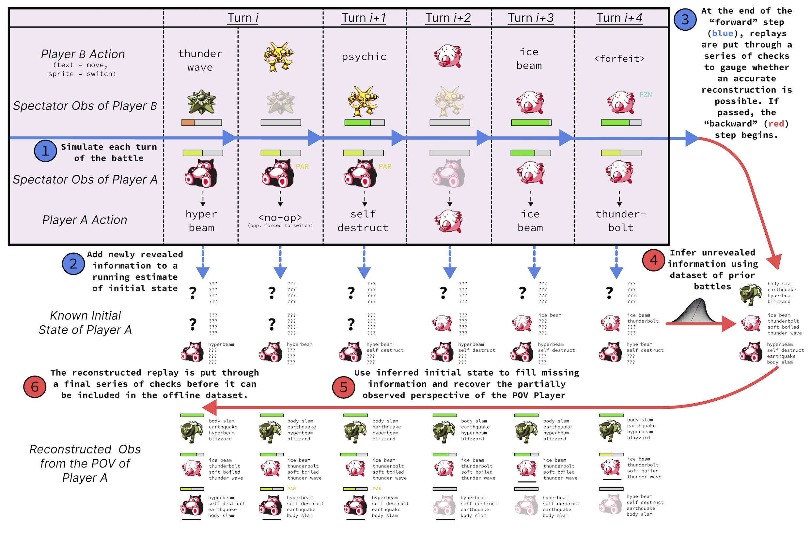

# Replay Parser

The replay parser converts from the spectator POV of raw Pokémon Showdown replays to the first-peron POV of RL agents. In Showdown terms, this is a from-scratch python implementation of the sim protocol that simulates requests and predicts teams.

The process is summarized by the following (simplified) example.

  

For a real example, view [this replay](https://replay.Pokémonshowdown.com/gen4nu-776588848). The parser begins with the raw replay:

  

And infers missing information to produce training data like:

  

More information and discussion in Appendix D of the paper.