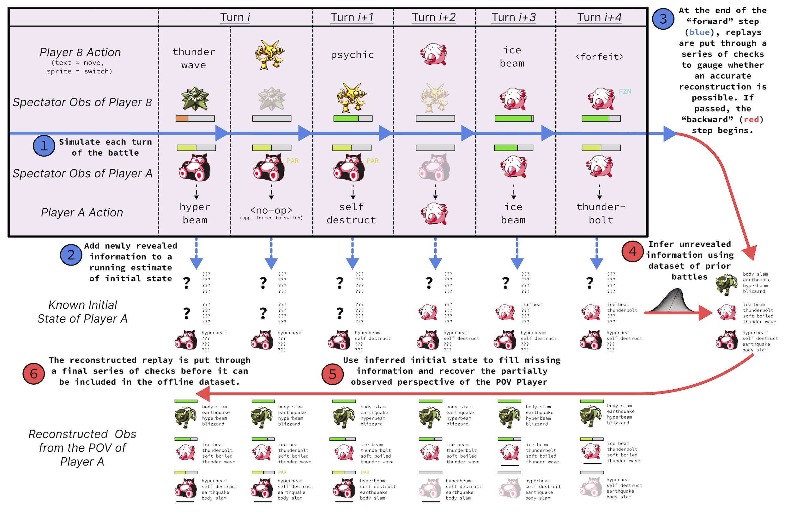
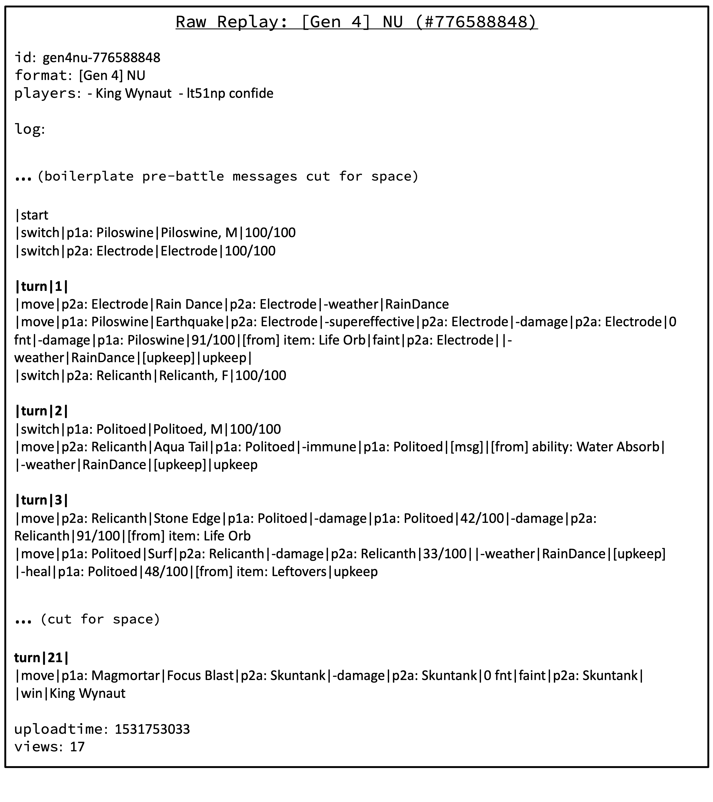
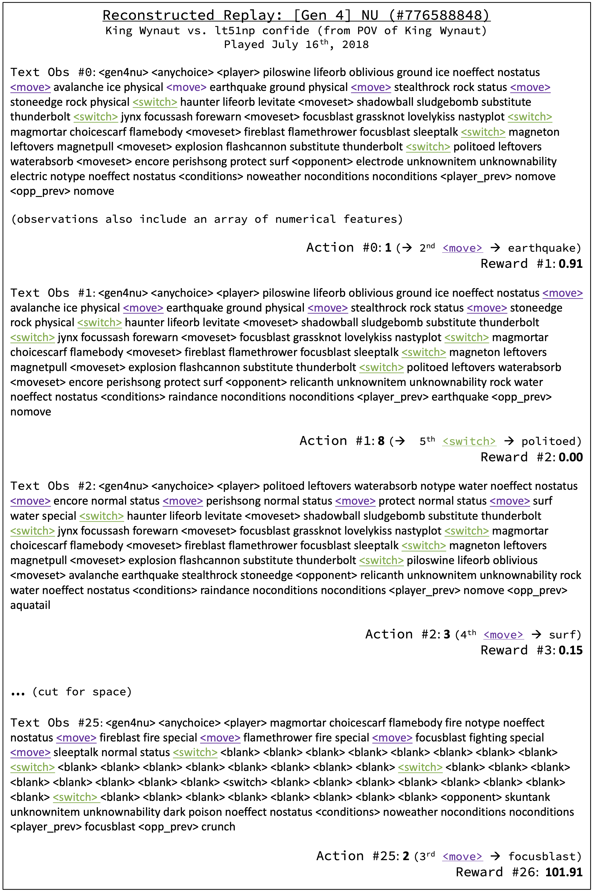
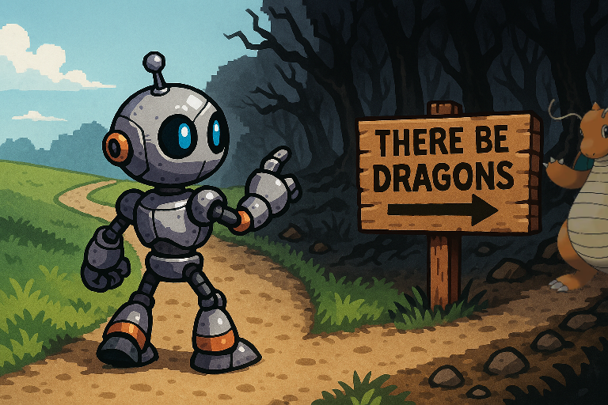

# Replay Parser

The replay parser converts from the spectator POV of raw Pokémon Showdown replays to the first-peron POV of RL agents. The process is summarized by the following (simplified) example:

  

For a real example, view [this replay](https://replay.Pokémonshowdown.com/gen4nu-776588848). The parser begins with the raw replay:

  

And infers missing information to produce training data like:

  

More information and discussion in Appendix D of the paper.

**If you would like to train on your own set of Showdown replay logs, and/or would like to change the observation or reward function of existing replays, you will need run the replay parser**. Please be warned that it is poorly documented and requires significant Pokémon knowledge to debug/improve/extend. It is not really expected that this part of the codebase will be used externally. However, you can open an issue and I will get back to you. Updates are expected:

### Roadmap
- Improved team inference logic (beyond all-time averages of Showdown usage stats)
- Support for Gen1-4 random battles
- Observation space extensions to address our main limitations (sleep/freeze clause tracking, PP counts)

I've received a lot of questions about support for later generations and doubles battles. This replay parser is the main obstacle. I am interested in expanding to new battle formats, but do not expect to get to this myself in the near future. **I would absolutely welcome PRs from Showdown community members**. Feel free to open an issue or get in touch with me at `grigsby[at]cs[dot]utexas[dot]edu`.

  

